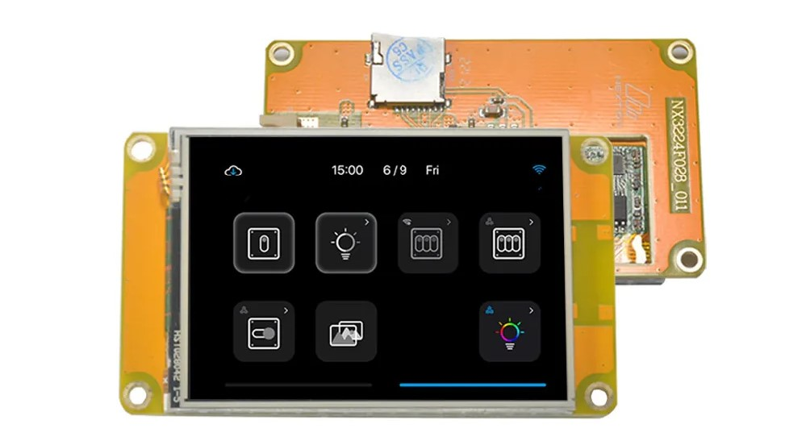

# Nextion-Micropython
Repository für die Verwendung eins Nextion HMI Displays mit einem ESP32



# Links

[Quickstart](https://itead.cc/nextion-display/)

[Nextion Software](https://nextion.tech/nextion-editor/#_section1)

[Software Tutorials](https://www.boecker-systemelektronik.de/Seite-/-Kategorie-1/NextionTutorials/Der-Nextion-Editor)

[UART Micropython](https://docs.micropython.org/en/latest/library/machine.UART.html)


## Kommunikation

Die Verbindung zwischen ESP und Display erfolgt über UART
```python
import machine
uart = machine.UART(1, tx=25, rx=26, baudrate=9600)
```
## Senden von Befehlen
```python
end_cmd = b'\xFF\xFF\xFF'

def send(cmd):
    uart.write(cmd)
    uart.write(end_cmd)
    time.sleep_ms(100)
    answerNex =  uart.read()
    print("Response:", answerNex)
    return answerNex
```


## Übersicht an Befehlen
[Weitere Befehle](https://www.boecker-systemelektronik.de/Seite-/-Kategorie-1/NextionTutorials/Befehlsuebersicht)

## Beispiel Befehke
Wechsel zur Seite 1 / 2
```python
send("page 1")
send("page 2")
```
Lesen, was im Textbaustein t1 steht
```python
send("get t1.txt")
```
Welchen Wert hat der Baustein n0 
```python
send("get n0.val")
```
